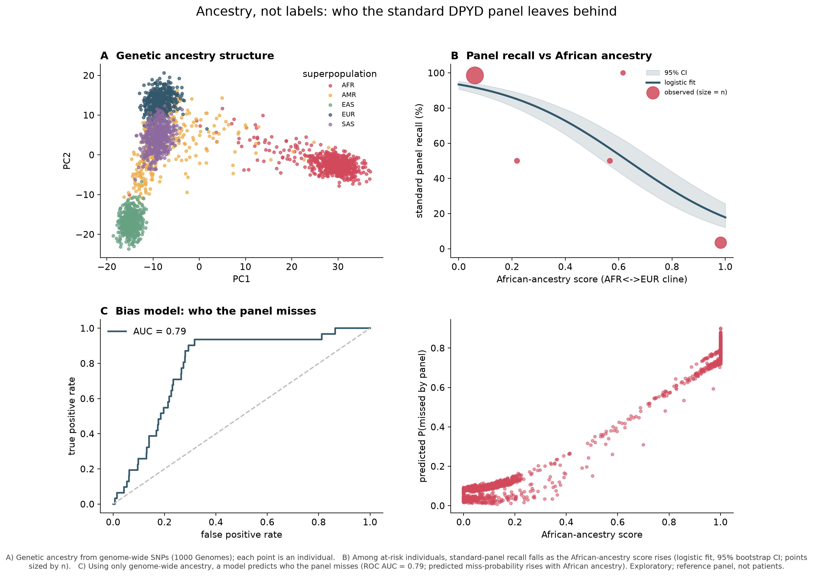

# DPYD pharmacogenetic equity: does the standard panel protect every ancestry?

A reproducible, open-data audit of the standard DPYD genetic panel used to prevent
fluoropyrimidine (5-FU / capecitabine) chemotherapy toxicity, asking a single
question: does a panel built from European-derived variants protect people of
other ancestries equally?

Short answer, reproduced from public data: no. And you can predict who it fails
from genome-wide ancestry alone.


> Honest framing up front. This is a reproduction of a known, published problem,
> not a discovery. It is an exploratory analysis over a population reference panel
> (1000 Genomes, ABraOM), not over patients, and it does not replace clinical
> guidance. Its value is methodological: a clean, transparent pipeline that shows
> how open genomic data already tells this story.

---

## Background

The fluoropyrimidines 5-fluorouracil and capecitabine are among the most widely
used chemotherapy drugs (colorectal, breast, gastric and other cancers). Roughly
10 to 30 percent of patients develop severe toxicity, and part of that is caused
by reduced activity of the DPD enzyme, encoded by the gene DPYD. A pre-treatment
genetic test exists for this: carriers of a reduced-function variant receive a
lower dose.

The catch is which variants the test looks at. The standard panel checks four
"tier 1" variants, all characterized in European populations. CPIC describes
additional actionable variants, including c.557A>G (rs115232898), which is
common in individuals of African ancestry and absent from the standard panel.

This project quantifies, from public data, how much that omission matters.

---

## What this repository does

Two connected analyses, both fully containerized:

1. Equity by ancestry. Allele frequencies of the actionable DPYD variants across
   1000 Genomes superpopulations, a correct CPIC activity score computed per
   haplotype, and the fraction of at-risk carriers the Eurocentric panel would
   miss in each group. A Brazilian frequency column is added from ABraOM.

2. From group to individual gradient. Genome-wide ancestry inference (PCA and a
   continuous African-ancestry axis), the standard panel's recall plotted against
   that continuous axis, and a model that predicts who the panel misses using
   ancestry alone, as a demonstration of algorithmic bias.

---

## Key results

All numbers below come from the pipeline in this repository.

**The missed variant is ancestry-specific.** c.557A>G (rs115232898) reaches about
2.3 percent in African ancestry and is essentially zero in European, East Asian
and South Asian groups (Wilson 95 percent CIs in `results/RESULTADOS.txt`). It is
not in the standard panel.

**The panel misses most African at-risk carriers.** Using the correct per-haplotype
CPIC activity score, the Eurocentric panel would miss about 90.6 percent of at-risk
individuals of African ancestry (29 of 32), 22.2 percent of admixed American, and
0 percent of European and South Asian individuals.

**A second blind spot.** East Asian individuals show almost no actionable DPYD
variants here, not because risk is absent but because the variants we currently
know are rare in that group, which remains understudied in pharmacogenomics. Two
different kinds of inequity in the same test.

**It reaches Brazil.** In the ABraOM SABE-1171 cohort (1,171 admixed Brazilians,
whole-genome), c.557A>G appears at about 0.26 percent, roughly one carrier in 200.
Diluted by admixture, far from zero, and still outside the panel.

**The failure is a continuous gradient, predictable from ancestry.** Among at-risk
individuals, the standard panel's recall falls from about 99 percent at low
African ancestry to about 7 percent at high African ancestry. A model using only
genome-wide ancestry (no DPYD locus) predicts who the panel misses with AUC 0.79.
The error is structured by ancestry, which is the textbook definition of bias.



---

## Methods

- Data: 1000 Genomes Project, GRCh38, biallelic phased release (IGSR / EBI),
  2,504 individuals. Brazilian frequencies from ABraOM SABE-1171-WGS (hg38).
- Variant functions: CPIC DPYD / fluoropyrimidine guideline.
- Position resolution: rsID to GRCh38 coordinates via the Ensembl REST API, then
  matching by genomic position (the 1000 Genomes VCF does not carry rsIDs in the
  ID column, so matching by rsID silently fails).
- Activity score: the CPIC rule applied per haplotype. Each haplotype takes the
  minimum activity among the variants it carries; the gene score is the sum of the
  two haplotypes. This handles homozygotes, heterozygotes and compound
  heterozygotes correctly (validated against synthetic cases).
- Frequencies reported with Wilson 95 percent confidence intervals.
- Ancestry: about 2,500 common, spaced SNPs from a chr1 region far from DPYD;
  PCA by SVD; a continuous African-ancestry score along the AFR to EUR cline.
- Bias model: logistic regression predicting "missed by panel" from ancestry
  principal components, evaluated by cross-validated ROC AUC.

---

## Scope and limitations

- This reproduces published findings; it is not a novel result. See for example a
  2024 British Journal of Cancer systematic review on DPYD coverage across
  ancestries, and a Journal of Clinical Oncology piece on pharmacogenomic equity.
- The data are population reference panels, not patient cohorts. The analysis
  measures panel coverage over variant carriers, not measured clinical toxicity.
- Carrier counts per group are small; intervals are reported for that reason.
- The ancestry score is a supervised PCA-based axis, not a formal ADMIXTURE
  proportion. The bias model demonstrates structure, not clinical prediction.

---

## Reproduce it

Requires Docker. The whole pipeline runs from the container; no local Python setup.

```bash
docker compose up
```

This runs, in order: data download and variant extraction, frequencies with the
CPIC haplotype score, the Brazilian step (if the ABraOM file is present), the text
report, the figure set, and the publication composites.

Heavier optional steps (ancestry and the bias model) can be run on their own:

```bash
docker compose run --rm pgx python 06_ancestry.py
docker compose run --rm pgx python 07_gradient_ml.py
```

Brazilian data (optional). ABraOM has no open API. Request the SABE-1171-WGS (hg38)
file from https://abraom.ib.usp.br/download (academic use, citation required) and
place it as `data/SABE1171.Abraom.clean.tar.gz`. The pipeline reads it in streaming
and adds a Brazil column automatically. Without it, every other step still runs.

---

## Repository layout

```
config.py             panel, CPIC variants, paths, parameters
01_download.py        resolve rsIDs (Ensembl) and extract phased haplotypes
02_frequencies.py     allele frequencies + CPIC per-haplotype activity score
03_figures.py         publication composite (frequency + equity)
04_report.py          consolidated text report (results/RESULTADOS.txt)
05_brazil.py          Brazilian frequencies from the ABraOM TSV
06_ancestry.py        genome-wide PCA + continuous African-ancestry score
07_gradient_ml.py     recall-by-ancestry curve + bias model + composite
viz_all.py            full set of alternative figure styles
run_pipeline.py       runs the steps in order
Dockerfile, docker-compose.yml, requirements.txt
data/  results/  figures/
```

---

## Data sources and citations

- 1000 Genomes Project Consortium. A global reference for human genetic variation.
- CPIC. Guideline for fluoropyrimidines and DPYD.
- Ensembl REST API (variant to GRCh38 coordinate resolution).
- ABraOM, SABE-1171-WGS. Naslavsky et al. (please cite when using the Brazilian
  data, as the database requires).

If you publish or present this, complete the literature citations above with the
exact references for the British Journal of Cancer and Journal of Clinical
Oncology articles mentioned in Scope.

---

## License

MIT. See `LICENSE`.

## Author

Tiago Fernando Chaves. Biologist, PhD in Cell and Developmental Biology.
Built as a reproducible bioinformatics portfolio project.
